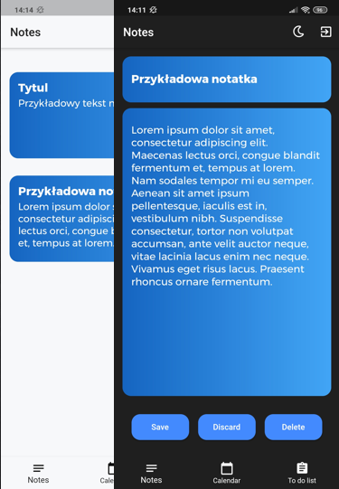
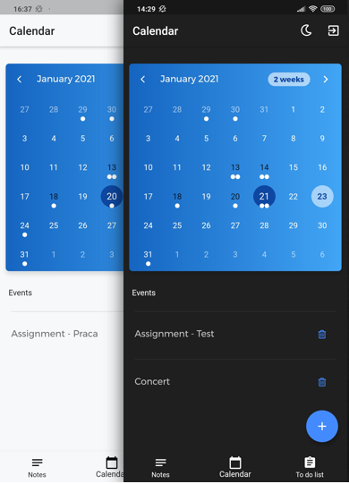
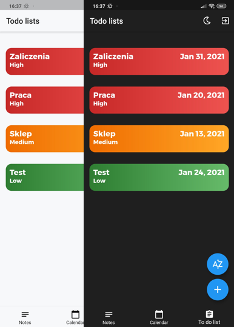
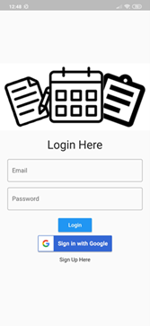

# Flutter Organizer

`Flutter` `Dart` `Firebase Authentication` `Cloud Firestore`

Android app made using Flutter and Dart that allows you to write some notes, add events to calendar and create To do lists.

##                                                           Notes

##                                                           Calendar

##                                                           To-Do lists

##                                                           Login Screen

